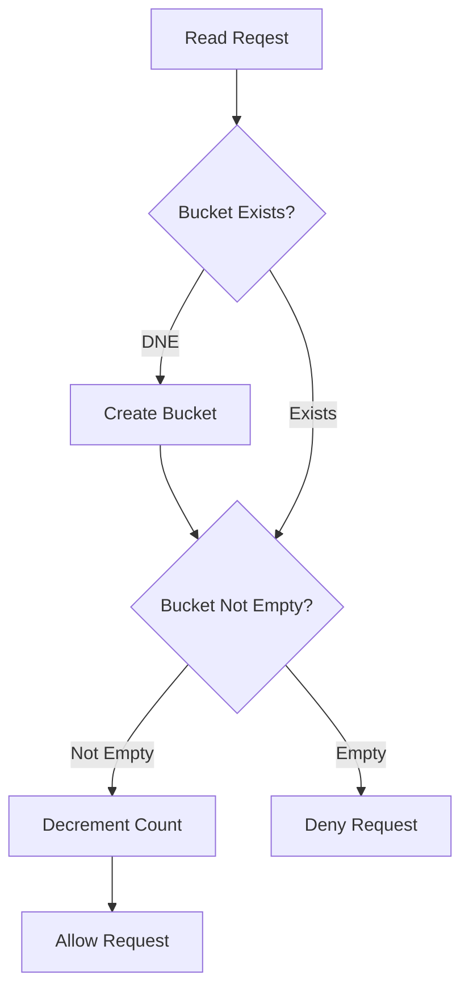

# Rate Limiter

We want to build a rate limiter that prevents a service from being accessed more than `b` times per for every `r` seconds.

One way to build this is with the [Token Bucket](https://en.wikipedia.org/wiki/Token_bucket) Algorithm, which is a structure that maintains a bucket that contains tokens for each user. Each token represents one request that is allowed through, so any time a request is allowed through, a token is first removed. If a bucket contains 0 tokens by the time a request arrives, the request is denied. Every bucket is also refilled either to the maximum amount of tokens every `r` seconds or Every bucket gets one token added every `1/r` seconds. If a bucket is at max capacity, tokens will not be added.

One way to implement a rate limiter is to use redis as the database that maps a user to a number of how many tokens are in that user's bucket. A cron job can be used to replenish tokens of buckets that are not at max capacity and another cron job can be used to delete entries at max capacity every `m, m > r` seconds in an attempt to remove inactive users.

The flowchart would look like the following:

