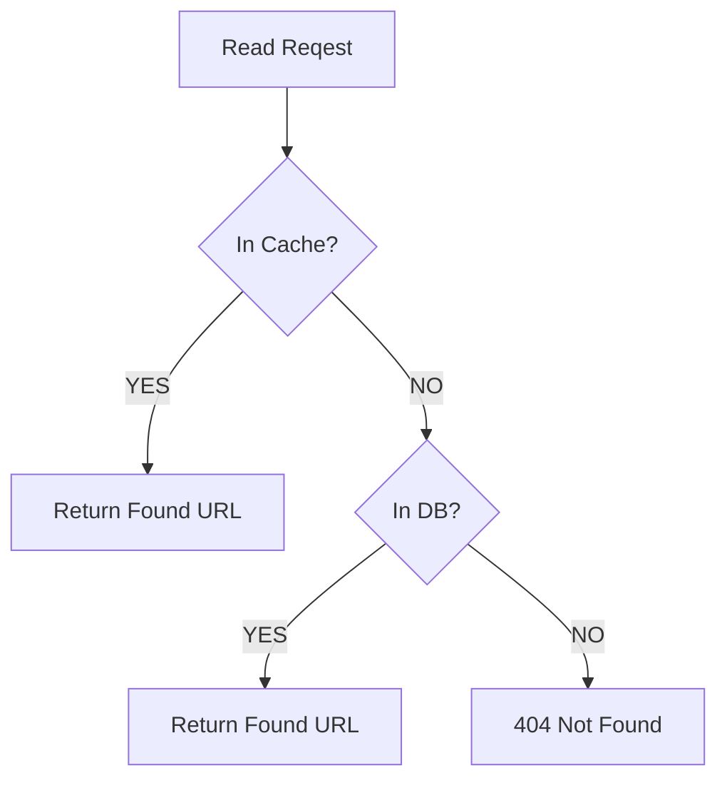

# URL Shortener

When creating a URL Shortener, we want to associate a hash with a longer URL. This hash will be in the slug of the URL that redirects to the longer URL. So if we have a long url we want to shorten, let's say `longurlwewanttoshorten.com` and our short url is called `shorturl.com` and we hash the longer url to `6be7u5` then we will have `shorturl.com/6be7u5` redirect to `longurlwewanttoshorten.com`.

To do this, we want a hash function that converts the long urls to a base 64 URL encoding of length 6, which should give us 68 billion hashes to work with (we can always increase the length to more characters if we need more than 68 billion hashes). Then we store this in a SQL database with the schema being `ShortenedURLs(id, hash, longURL)`. Since we expect database reads to be more common than database writes, we also want a cache to store recently accessed URLs (redis is a good candidate for this). The flowchart will look like this:

## 301 redirect vs 302 redirect

There's 2 ways we can implement the redirects, a permanent redirect with 301 and a temporary redirect with 302. We would want 301 if we want future requests to a `shorturl.com` with a hash to just directly redirect to the long url without a request hitting our servers, thus decreasing the load in our servers. However, if we plan to collect analytics of visits to the short url with a hash, we would want to use the 302 temporary redirect so that we can still recieve a request to log the number of redirects in exchange for the increased traffic when compared to the 301 permanent redirect.